# LAB1 : Partitionnement et Montage

Ce guide détaille les étapes pour créer, formater et monter des partitions sous Linux.

## Prérequis
- Une machine virtuelle avec un disque supplémentaire de 5 Go (Type SCSI).
- Accès root ou sudo.

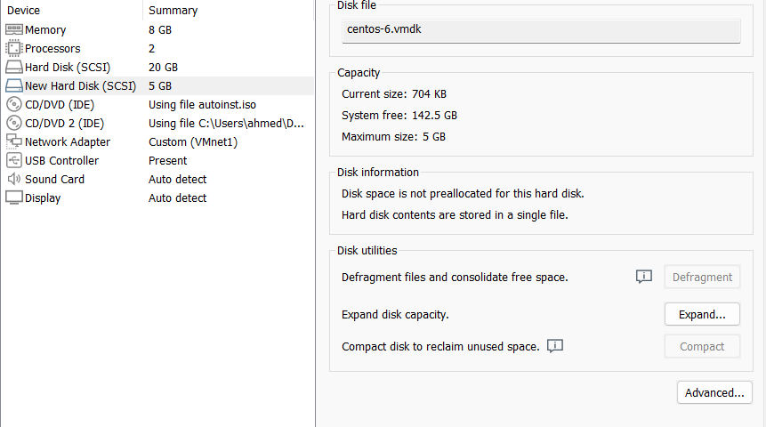

## Partie 1 : Partitionnement avec fdisk et Montage
### 1. Vérification des partitions existantes
```bash
sudo fdisk -l
```
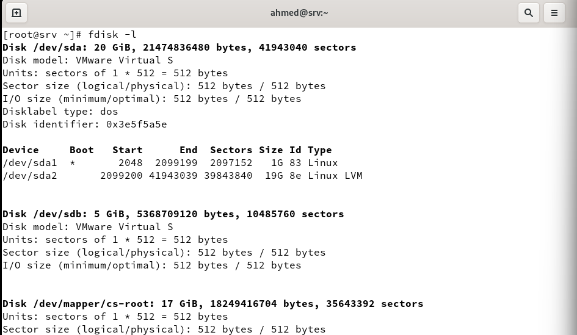


### 2. Création d'une nouvelle partition de 500 Mo
```bash
sudo fdisk /dev/sdb
```

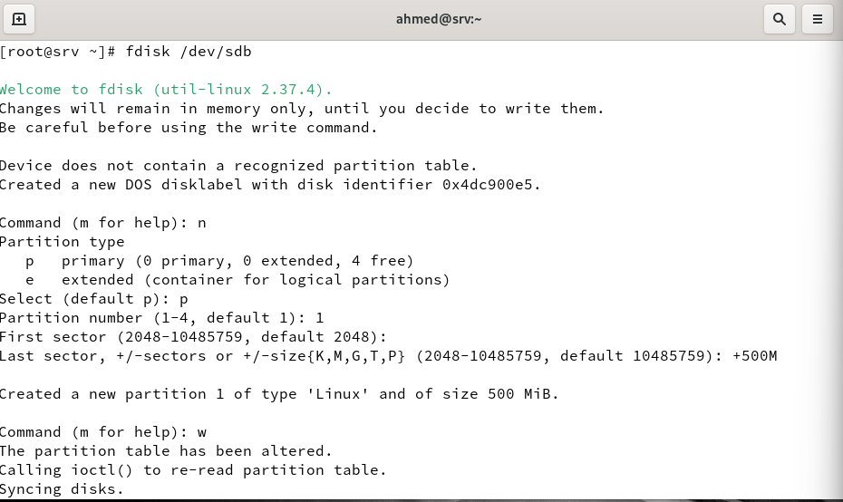

### 3. Vérification de la création de la partition
```bash
sudo lsblk
```
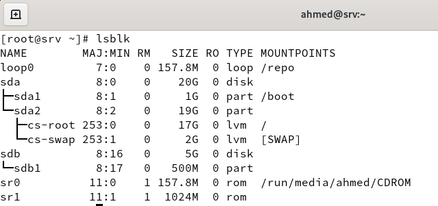


### 4. Formatage de la partition en ext3
```bash
sudo mkfs.ext3 /dev/sdb1
```
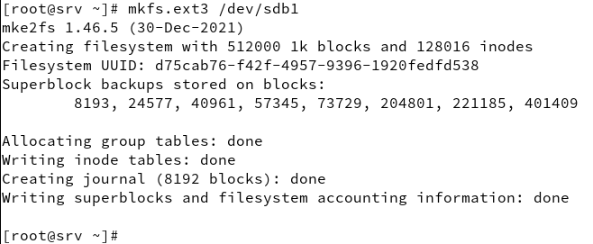

### 5. Vérification des systèmes de fichiers disponibles
```bash
ls /sbin/mkfs.*
```

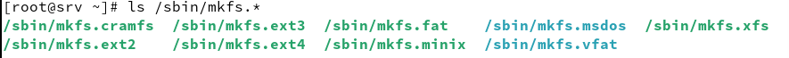

### 6. Vérification des partitions montées
```bash
mount | column -t
```


### 7. Montage de la partition sur /mnt
```bash
sudo mount /dev/sdb1 /mnt
```
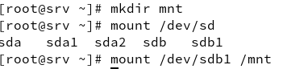

### 8. Vérification du montage
```bash
df -h | grep /mnt
```

### 9. Montage automatique au démarrage
Ajoutez cette ligne dans `/etc/fstab` :
```bash
echo '/dev/sdb1 /mnt ext3 defaults 0 2' >> /etc/fstab
```

### 10. Démontage de la partition
```bash
sudo umount /mnt
```
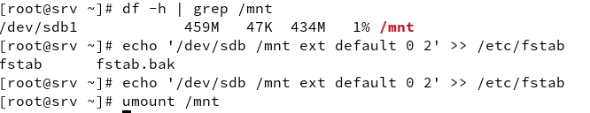

## Partie 2 : Création d'une partition swap
### 11. Vérification de l'espace swap
```bash
free -m
```

### 12. Création et activation d'une partition swap de 1G
```bash
sudo fdisk /dev/sdb
```


```bash
sudo mkswap /dev/sdb2
sudo swapon /dev/sdb2
```
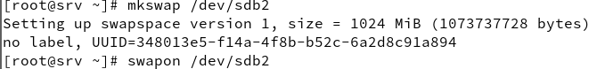


### 13. Montage automatique du swap
Ajoutez cette ligne à `/etc/fstab` :
```bash
echo '/dev/sdb2 none swap sw 0 0' >> /etc/fstab
```

### 14. Vérification de l'espace swap
```bash
free -m
```
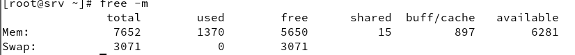

## Partie 3 : Partitionnement avec parted
### 15. Lancer parted
```bash
sudo parted /dev/sdb
```


### 16-19. Création d'une partition primaire en xfs
`parted` est un outil avancé de gestion des partitions qui permet de créer, redimensionner et gérer les partitions sur un disque.

Dans cette commande :
- `mkpart` : crée une nouvelle partition.
- `primary` : définit la partition comme primaire.
- `xfs` : spécifie que le type de fichier prévu est XFS (notez que `parted` ne crée pas réellement le système de fichiers, il indique simplement l'intention).
- `2G 4G` : définit les limites de la partition, débutant à 2 Go et se terminant à 4 Go sur le disque.

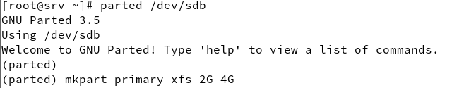


```bash
(parted) mkpart primary xfs 2G 4G
```

### 20. Création du système de fichiers
```bash
sudo mkfs.xfs /dev/sdb3
```
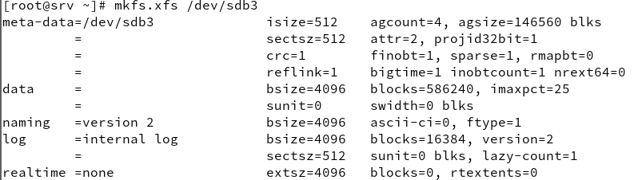

### 21. Montage de la nouvelle partition sur /mnt
```bash
sudo mount /dev/sdb3 /mnt
```
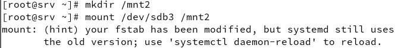

---
