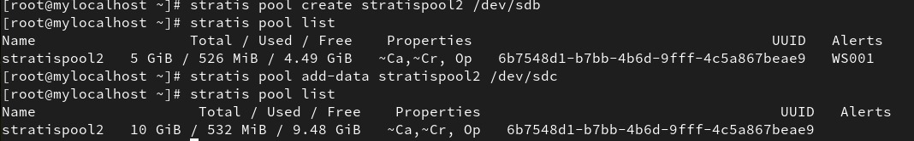

# Gestion du stockage avec Stratis

## Objectif
Ce guide détaille les étapes de gestion du stockage en utilisant Stratis pour l'examen Red Hat.

## Prérequis
- Deux disques ajoutés à la machine virtuelle (taille = 5 Go chacun)
- Un système Linux compatible avec Stratis

## Installation et configuration

### 1. Installation des packages
```sh
sudo yum install -y stratisd stratis-cli
```

### 2. Activation du service Stratis
```sh
 systemctl enable stratisd
```

### 3. Création du pool Stratis
```sh
 stratis pool create stratispool2 /dev/sdb
```

### 4. Vérification du pool
```sh
stratis pool list
```
 
 
### 5. Ajout d'un périphérique au pool
```sh
 stratis pool add-data stratispool2 /dev/sdc
```

### 6. Vérification de la taille du pool
```sh
stratis pool list
```
 
 
### 7. Vérification des périphériques de bloc
```sh
stratis blockdev list
```
 
 
## Gestion du système de fichiers Stratis

### 8. Création d'un système de fichiers
```sh
 stratis filesystem create stratispool2 stratis-filesystem1
```

### 9. Vérification du système de fichiers
```sh
stratis filesystem list
```
 
 
### 10. Création et montage du volume
```sh
 mkdir /stratisvol
 mount /stratis/stratispool2/stratis-filesystem1 /stratisvol
```

### 11. Vérification du montage
```sh
mount | grep stratis
```
 

 
### 12. Création de fichiers de test
```sh
echo "Hello World!" > /stratisvol/file1
sudo dd if=/dev/urandom of=/stratisvol/file2 bs=1M count=2048
```

### 13. Vérification de l'utilisation
```sh
stratis filesystem list
```
 

## Gestion des snapshots

### 14. Création d'un snapshot
```sh
 stratis filesystem snapshot stratispool2 stratis-filesystem1 stratis-filesystem1-snap
```

### 15. Vérification du snapshot
```sh
stratis filesystem list
```
 

 
### 16. Suppression et récupération de fichiers
```sh
 rm /stratisvol/file1
 mkdir /stratisvol-snap
 mount /stratis/stratispool2/stratis-filesystem1-snap /stratisvol-snap
 /stratisvol-snap
```

### 17. Nettoyage et suppression
```sh
umount /stratisvol /stratisvol-snap
stratis filesystem destroy stratispool2 stratis-filesystem1-snap
stratis filesystem destroy stratispool2 stratis-filesystem1
```
 

 
